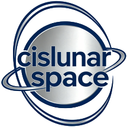

Transfer Orbit Design 文档
==========================

Transfer Orbit Design 提供地月 CR3BP 轨道生成、DRO/RO/GEO/LEO 转移设计、CR3BP 到星历模型修正，以及配套 GUI 和绘图脚本。

.. toctree::
   :maxdepth: 2
   :caption: 入门与规范

   narrative/readme
   narrative/development
   narrative/parameters

.. toctree::
   :maxdepth: 2
   :caption: API 参考

   tod/index

.. toctree::
   :maxdepth: 1
   :caption: PRD 文档

   narrative/prd-002-dro-3d-view-center-selection
   narrative/prd-003-ephemeris-conversion-scripts-redesign
   narrative/prd-004-gui-script-tab-auto-switch
   narrative/prd-005-fix-ci-and-release
   narrative/prd-006-update-sphinx-docs

索引
====

* :ref:`genindex`
* :ref:`modindex`
* :ref:`search`
