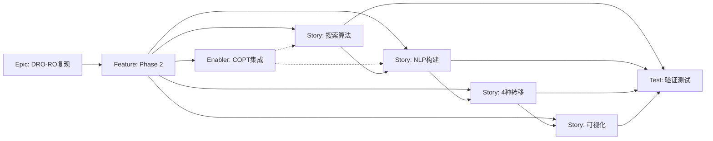

# Phase 2: DRO到RO转移轨道设计 - Issues创建检查清单

本文档列出Phase 2实施过程中需要创建的GitHub Issues及其详细规格。

## Issue创建清单

### Pre-Creation Preparation
- [x] **特性文档完整**: PRD、实施方案、技术分解已完成
- [x] **Phase 1完成**: DRO和RO族生成已完成
- [ ] **COPT安装验证**: 确认coptpy包可用
- [ ] **代码库同步**: e2m2e核心库已同步到最新

---

## Issue层级结构

```
Epic: DRO-RO转移轨道设计复现
└── Feature: Phase 2 - 平面DRO到RO转移轨道设计
    ├── Story: 搜索阶段算法实现
    ├── Story: 优化阶段NLP构建
    ├── Story: 4种平面转移路径计算
    ├── Story: 解平面可视化
    ├── Enabler: COPT求解器集成
    └── Test: 转移轨道验证测试
```

---

## Issue模板

### Epic Issue

```markdown
# Epic: DRO-RO转移轨道设计复现

## Epic Description

复现论文"Cui et al. (2025) Two-Impulse Transfers from Lunar Distant Retrograde Orbits to Resonant Orbits"中的转移轨道设计方法，实现从DRO到RO的两脉冲转移。

## Business Value

- **Primary Goal**: 建立完整的地月空间轨道转移设计能力
- **Success Metrics**: 
  - 转移代价与论文偏差 < 10%
  - 转移时间与论文偏差 < 15%
- **User Impact**: 为未来地月空间任务提供转移轨道设计工具

## Epic Acceptance Criteria

- [ ] Phase 1: DRO和RO族生成完成
- [ ] Phase 2: 平面DRO-RO转移设计完成
- [ ] Phase 3: BR4BP转移设计完成
- [ ] Phase 4: 星历模型验证完成
- [ ] 论文Fig.6-11复现

## Labels

`epic`, `priority-high`, `orbital-mechanics`

## Milestone

Phase 2: 2026-03
```

### Feature Issue

```markdown
# Feature: Phase 2 - 平面DRO到RO转移轨道设计

## Feature Description

实现"搜索-优化"两步法，设计CR3BP中从DRO到RO的两脉冲转移轨道。

## User Stories in this Feature

- [ ] #{story-issue} - 搜索阶段算法实现
- [ ] #{story-issue} - 优化阶段NLP构建
- [ ] #{story-issue} - 4种平面转移路径计算
- [ ] #{story-issue} - 解平面可视化

## Technical Enablers

- [ ] #{enabler-issue} - COPT求解器集成

## Dependencies

**Blocks**: Phase 3, Phase 4
**Blocked by**: Phase 1 (已完成)

## Acceptance Criteria

- [ ] 4种平面转移路径可计算
- [ ] 解平面结构与论文一致
- [ ] 三种转移类型可正确分类
- [ ] 转移代价与论文Table 4偏差 < 10%

## Labels

`feature`, `priority-high`, `phase-2`

## Epic

#{epic-issue-number}

## Estimate

L (20-40 story points)
```

### Story Issues

#### Story 1: 搜索阶段算法实现

```markdown
# User Story: 搜索阶段算法实现

## Story Statement

As a ** researcher **, I want to ** 通过网格搜索找到转移轨道的初始可行解 ** so that ** 为优化阶段提供良好的初始猜测 **。

## Acceptance Criteria

- [ ] 出发点从DRO族中等时间间隔采样200个点
- [ ] α ∈ [0.5, 2.5], β ∈ [-0.5, 0.5] 网格化
- [ ] 前向积分返回转移轨迹
- [ ] 筛选出与RO相交或距离局部最小的候选解
- [ ] 并行化搜索加速计算

## Technical Tasks

- [ ] 实现TransferSearchVariables数据结构
- [ ] 实现compute_departure_velocity速度计算
- [ ] 实现前向积分模块
- [ ] 实现轨迹筛选模块

## Dependencies

**Blocked by**: Phase 1完成

## Labels

`user-story`, `priority-high`, `search-phase`

## Feature

#{feature-issue}

## Estimate

8 story points
```

#### Story 2: 优化阶段NLP构建

```markdown
# User Story: 优化阶段NLP构建

## Story Statement

As a ** researcher **, I want to ** 将转移问题构建为NLP问题并用COPT求解 ** so that ** 获得最优转移轨道 **。

## Acceptance Criteria

- [ ] 优化变量 y = {α, T, t_ins}
- [ ] 目标函数 J(y) = Δv₁ + Δv₂
- [ ] 位置连续约束正确
- [ ] 速度角度约束正确（可松弛）
- [ ] 不撞击约束正确
- [ ] COPT求解器可正常求解

## Technical Tasks

- [ ] 实现TransferNLPVariables数据结构
- [ ] 实现目标函数计算
- [ ] 实现所有约束函数
- [ ] 集成COPT求解器

## Dependencies

**Blocked by**: Story 1完成

## Labels

`user-story`, `priority-high`, `optimization-phase`

## Feature

#{feature-issue}

## Estimate

13 story points
```

#### Story 3: 4种平面转移路径计算

```markdown
# User Story: 4种平面转移路径计算

## Story Statement

As a ** researcher **, I want to ** 计算4种DRO-RO转移组合 ** so that ** 覆盖不同轨道能量级别 **。

## Acceptance Criteria

- [ ] 2:1 DRO → 3:2 RO 可计算
- [ ] 3:1 DRO → 3:2 RO 可计算
- [ ] 2:1 DRO → 3:1 RO 可计算
- [ ] 3:1 DRO → 3:1 RO 可计算
- [ ] 结果保存为JSON格式

## Technical Tasks

- [ ] 加载DRO和RO族数据
- [ ] 执行完整搜索-优化流程
- [ ] 保存转移结果

## Dependencies

**Blocked by**: Story 2完成

## Labels

`user-story`, `priority-high`, `transfer-computation`

## Feature

#{feature-issue}

## Estimate

5 story points
```

#### Story 4: 解平面可视化

```markdown
# User Story: 解平面可视化

## Story Statement

As a ** researcher **, I want to ** 可视化解平面并分类转移类型 ** so that ** 分析转移特性 **。

## Acceptance Criteria

- [ ] T vs Δv 解平面图可绘制
- [ ] Pareto前沿正确标识
- [ ] 三种转移类型（直接/LGA/外部）正确分类
- [ ] 四分位图正确绘制

## Technical Tasks

- [ ] 实现解平面绘图函数
- [ ] 实现转移类型分类器
- [ ] 实现四分位图绘制

## Dependencies

**Blocked by**: Story 3完成

## Labels

`user-story`, `priority-medium`, `visualization`

## Feature

#{feature-issue}

## Estimate

5 story points
```

### Enabler Issue: COPT求解器集成

```markdown
# Technical Enabler: COPT求解器集成

## Enabler Description

集成COPT优化求解器，支持NLP问题求解，并提供scipy回退方案。

## Technical Requirements

- [ ] COPT安装验证
- [ ] COPT NLP问题接口封装
- [ ] 求解参数配置
- [ ] scipy.optimize回退实现

## Implementation Tasks

- [ ] 验证coptpy包可用
- [ ] 创建COPTNLPSolver类
- [ ] 实现问题构建接口
- [ ] 实现结果解析接口
- [ ] 实现scipy回退

## Acceptance Criteria

- [ ] COPT可用时使用COPT求解
- [ ] COPT不可用时自动切换scipy
- [ ] 求解器可集成到优化流程

## Labels

`enabler`, `priority-high`, `solver-integration`

## Feature

#{feature-issue}

## Estimate

5 story points
```

### Test Issue

```markdown
# Test: 转移轨道验证测试

## Test Description

验证转移轨道设计结果的正确性和精度。

## Testing Requirements

- [ ] TEST-007: 搜索算法正确性验证
- [ ] TEST-008: NLP问题构建验证
- [ ] TEST-009: COPT求解器验证
- [ ] TEST-010: 位置连续性验证
- [ ] TEST-011: 速度连续性验证
- [ ] TEST-012: 不撞击约束验证
- [ ] TEST-013: 论文Table 4对比验证

## Dependencies

**Blocked by**: Stories 1-4完成

## Labels

`test`, `priority-high`, `verification`

## Feature

#{feature-issue}

## Estimate

3 story points
```

---

## 依赖关系图



---

## 优先级和估算矩阵

| Issue | 类型 | 优先级 | 估算 | 状态 |
|-------|------|--------|------|------|
| Epic: DRO-RO复现 | Epic | P0 | XL | Pending |
| Feature: Phase 2 | Feature | P0 | L (30pts) | Pending |
| Story: 搜索算法 | Story | P0 | 8pts | Pending |
| Story: NLP构建 | Story | P0 | 13pts | Pending |
| Enabler: COPT集成 | Enabler | P0 | 5pts | Pending |
| Story: 4种转移 | Story | P1 | 5pts | Pending |
| Story: 可视化 | Story | P1 | 5pts | Pending |
| Test: 验证测试 | Test | P1 | 3pts | Pending |

**总估算**: 39 story points (M-L级别)
